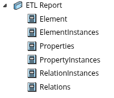
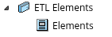
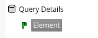
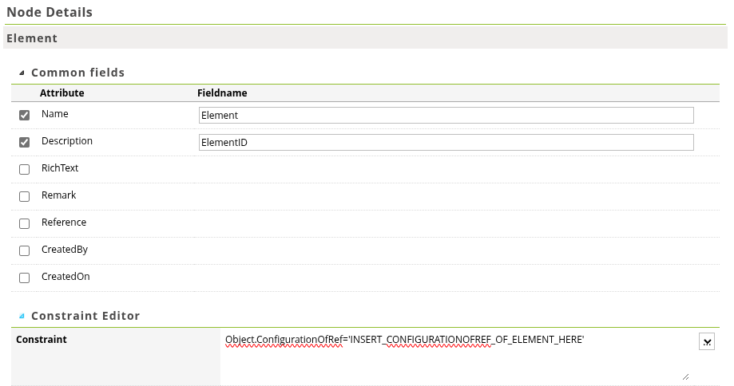

# Setting up the right Relatics report and webservice.

In order to make the ETL process work a very specific relatics report and webservice needs to be setup. This webservice will be used by the `relatics_conenctor.Extractor` in order to produce the full extraction.

The ETL pipeline will do the following:

- Get a list of elements with their `ConfigurationOfRef` to be extracted and start a loop.
- Produce a table with the Name, Description, RichText and GUID of the Element and append all their relations with a **:1** cardinality.
- Produce a link table for each relation the element has to other elements with **:n** cardinality. The link table will only have the *ElementGUID*, *R2RelationElementGUID* and *workspaceid*
If a **requirement** element has a :n relation with the **Issue** element. The link table will be called **raw_relatics__requirement_issue** and will contain the columns: *requirement_guid*, *issue_guid* and *workspaceid*
- Combine all these tables into a dictionary and return it.

!!! danger "Warning!"
    Don't skip any steps in this setup. Copy names and query patterns exactly. The `run_ETL` method has some flexibility in report part naming, however the naming of the query values is very important to match this guide.
    If multiple workspaces are to be extracted in the same run ensure that the names of all the reports mentioned below are the same.

!!! tip
    Ensure that after creating a report you enter the *output extension* to be **xml**

## Setting up the Report structure
The report in relatics needs to be the following structure:

This is the only part where you can change a name. The report part which contains all elements to export is defaulted to `Elements`. If you so desire you can modify this name and pass it as an parameter in the `run_etl` method.
Next we will go more in depth of the individual report parts needed for the connector.

### Element

In order to make it easier to change which elements are retrieved in each workspace, a new Relatics element is created. This element has as the Instance name the name of the elemet to be included in extraction, e.g. `requirement`. The description is populated with the `ConfigurationOfRef` of this element. This way you can easily extend or reduce the list of elements included in the ETL pipeline.

The query you need is:

Node details of `Element` is:

Ensure you replace the `ConfigurationOfRef` in the constraint with your ConfigurationOfRef of the Relatics element that will hold the information of which elements to extract. A new page can now be made for this element in the Relatics environment with a table like this:

| Element (name) | ConfigurationOfRef (description) |
|---|---|
|requirement|123-abc-456|
|Issue|789-cde-123|